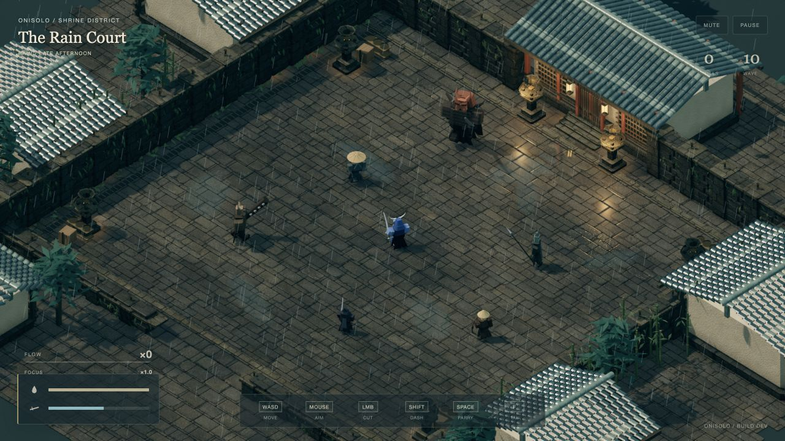
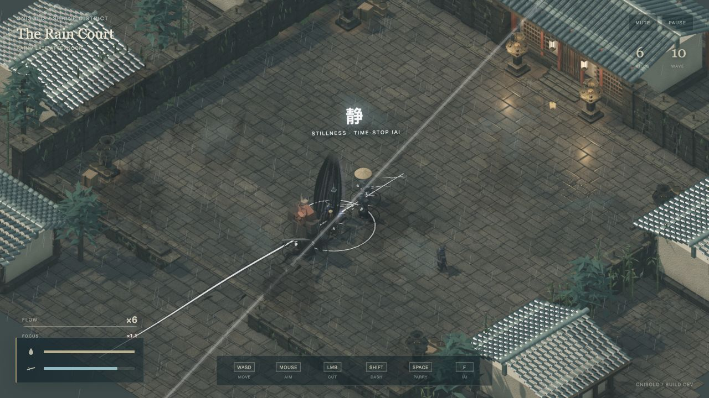
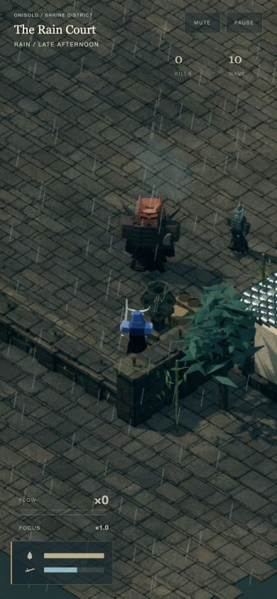

# Rain Court — lighting and surface pass

Lighting update included in build 98 on `codex/rain-court-art-direction`.
The sections below record the local validation completed before release.

## What changed

- The scene and reflection buffer use linear half-float HDR where supported.
  ACES filmic tone mapping runs once, at screen output. Bright lamps and steel
  highlights can exceed display white without being clipped in the scene buffer.
- A depth texture supplies ten-tap screen-space contact shading in the existing
  fullscreen pass. Its radius is expressed in world units for the orthographic
  camera. Shadow bias was reduced, and ambient fill was lowered relative to the
  directional key.
- The prefiltered environment is now a procedural HDR sky with clouds, a broad
  warm opening and a sun highlight. It is generated once; there is no new asset
  download or moving light count.
- Stone uses world-space relief and varying roughness/wetness. Glazed roof tiles
  and armor use clearcoat. Timber has directional grain; plaster has fine surface
  variation and weathering near its base. These are shader details on the
  existing meshes, not additional geometry.
- Cloth, skin, lacquer and steel have distinct material responses. Corpse instance
  batches preserve the source material's roughness, metalness and clearcoat,
  together with each character's colors.
- Puddle reflection strength varies with view angle, edges fade into the ground,
  and distortion is smaller. Direct rain uses a subtler blue-gray tint and is
  excluded from the reflected scene to avoid bright streak artifacts.

The material setup uses [Three.js physical materials](https://threejs.org/docs/pages/MeshPhysicalMaterial.html).
The implementation remains pinned to Three.js 0.169.0; its shader chunks were
checked against that version. This is more natural surface shading on the
existing stylized geometry. It does not add ray tracing, baked global
illumination, or photorealistic character topology.

## Verification

26 Node tests and 29 browser combat checks passed. The new browser assertion
verifies that corpse batches preserve steel, cloth and lacquer properties.
There were no shader compiler warnings or browser console errors during the
final checks. Desktop, 844 × 390 landscape and 390 × 844 portrait rendering were
inspected, including foreground edge visibility and iai.

The 20-second mixed-combat test with up to 24 enemies sampled 1,656 frames after
excluding the first 1.5 seconds: **11.17 ms mean, 16.90 ms P95, 18.30 ms P99,
zero frames over 25 ms, zero dropped simulation time**. HDR was active and the
point-light count stayed at two. Render DPR remains capped at 1.5, MSAA at four
samples, and reflections at 640 × 360 every fourth frame.

See [the raw performance result](performance-lighting.json) and
[the 29-check browser audit](browser-audit-lighting.json). The measurements are
desktop-specific and exclude cold-start shader compilation. The earlier art-only
pass measured 8.33 ms mean / 9.20 ms P95, but tab activity differed, so those
numbers are not a controlled A/B measurement. Final small changes to contrast
and rain opacity do not change the rendering workload.

## Actual browser captures

Before this lighting pass:

After:

These are held frames from the real local combat lab, not generated images.
[Open the local preview](http://127.0.0.1:5173/?preview=lighting).
