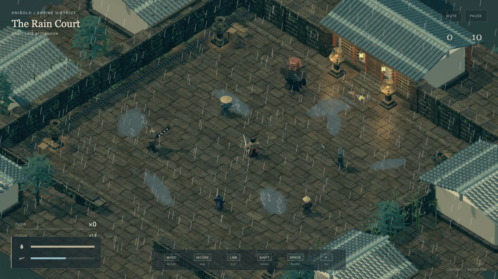
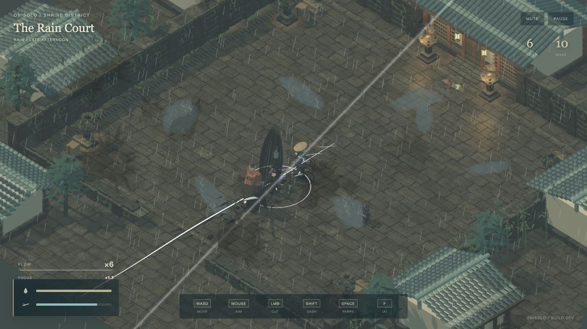
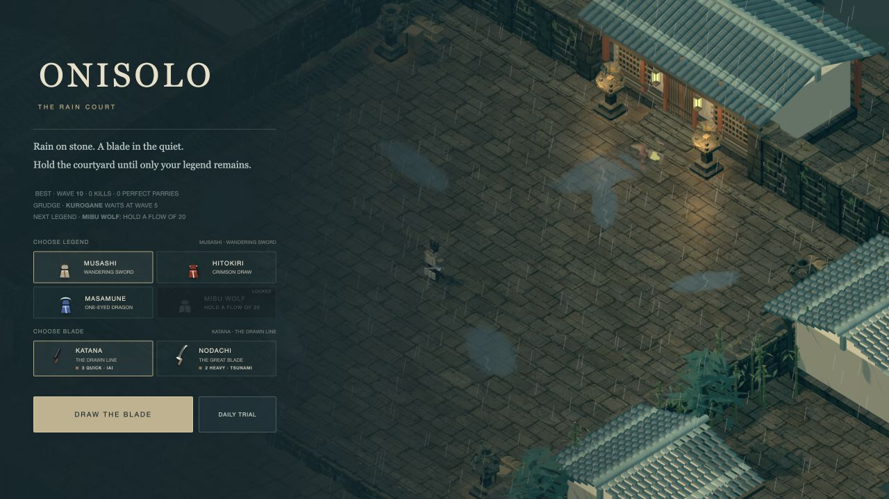
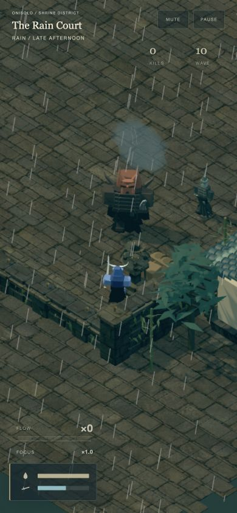

# Rain Court art direction

The subsequent [lighting and surface pass](lighting.md) adds HDR, contact
shading and richer materials. Its newer screenshots and performance results
supersede the initial visual baseline below.

Build 98 implementation on `codex/rain-court-art-direction`, based on the shipped
build-97 commit `8c5888dca9276d335b13d8dad690e70d01e0ffc5`. The sections below
record the local validation completed before release.

## Reference and visual decisions

The supplied [Anshu video](https://x.com/anshuc/status/2096008083826725132/video/1)
was inspected in the browser. The direction carries over its close isometric
composition, wet masonry, charcoal and teal architecture, olive planting, warm
lamps, and small readable figures. The game's setting remains a Japanese shrine
courtyard with an open fighting floor.

The playable implementation replaces the former monochrome paper landscape with
an authored district, material-based lighting, tiled roofs, lattice fronts,
lanterns, moss, bamboo, rain and shared puddle reflections. It is a stylized
interpretation of the reference, not a reproduction of its geometry.

## Source assets

- `rain-court-concept.png` is a built-in ImageGen concept target, not a game capture.
- `../../assets/textures/rain-court-stone.png` is the built-in ImageGen albedo used
  by the game. Exact generation prompts and provenance are in [prompts.md](prompts.md).
- `../../assets/models/rain-court-kit.blend` is the independent Blender source
  for nine reusable meshes, authored using the connected Blender MCP.
- `../../assets/models/rain-court-kit.js` is the quantized runtime export.
- Existing Blender character rigs supply four legends and six enemy types, now
  shaded with cloth, steel and armor materials in the full-color environment.

Regenerate the independent kit and runtime export on this machine:

```sh
/Applications/Blender.app/Contents/MacOS/Blender --background --factory-startup --python tools/build-rain-kit.py
```

The generator owns its own scene and does not clear unrelated interactive scenes.

## Rendering and gameplay

11,137 static scenery instances share geometry and material batches. One
shadowed directional key and two permanent shadowless lantern lights retain
fixed shader light counts during combat. Puddles share a 640 × 360 reflection
target refreshed every fourth rendered frame; ripples update continuously.
Render DPR is capped at 1.5 with four-sample MSAA. Pools retain explicit caps.

Wall limits and solid lantern/supply footprints constrain movement, dash
endpoints and iai destinations. Enemy arrivals retain distance at edges. The
portrait camera follows the player more closely; wide views preserve the
composed court. Touch play retains the existing landscape orientation prompt.

## Verification — September 5, 2026

- 26 Node tests passed, including bounds, prop collision, edge arrivals, mesh
  integrity, combat timing, pooling, wave progression and record isolation.
- 28 local browser combat checks passed. See [browser-audit.json](browser-audit.json).
- Title selection: Masamune and nodachi, start, movement/cut/dash/parry inputs,
  pause, resume and return to title.
- Defeat and in-place retry; discipline choice returned to gameplay.
- Desktop 1280 × 720, landscape 844 × 390, portrait 390 × 844. Portrait title
  had no horizontal overflow and its primary action remained visible. Player
  remained visible at the foreground corner. These are browser viewport checks,
  not measurements on physical phones.
- Final 20-second mixed combat run with up to 24 enemies: 2,220 sampled frames,
  8.33 ms mean, 9.20 ms P95, 9.40 ms P99, zero frames over 25 ms, zero dropped
  simulation time. First 1.5 seconds excluded for warm-up. Reference video and
  the secondary animated title were closed/blanked for this run.
  See [performance.json](performance.json).
- The final browser run reported no console errors. Earlier development errors
  were fixed and followed by a fresh reload and successful combat audit.

Performance is specific to this desktop/browser. An earlier run with other
animated tabs active measured 14.26 ms mean and 18.40 ms P95. The measurements
are not a guarantee for all hardware.

## Actual game screenshots

All files below are direct browser captures. Combat studies use explicit local
QA controls to hold an actual rendered frame; they are not generated mockups.






To review locally, run `node dev-server.mjs` and open
[the game](http://127.0.0.1:5173/). The optional
[combat lab](http://127.0.0.1:5173/?profile=1&qa-scenario=combat) supplies
Court study, Edge study, signature stages, the audit and the stress run.
Backquote shows/hides its controls. QA modes are restricted to localhost.
