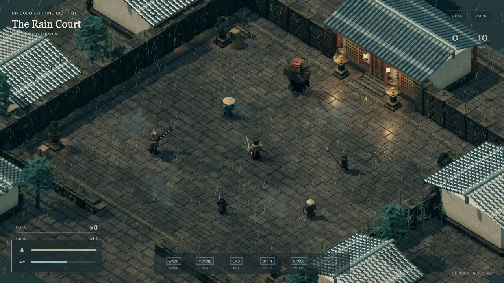
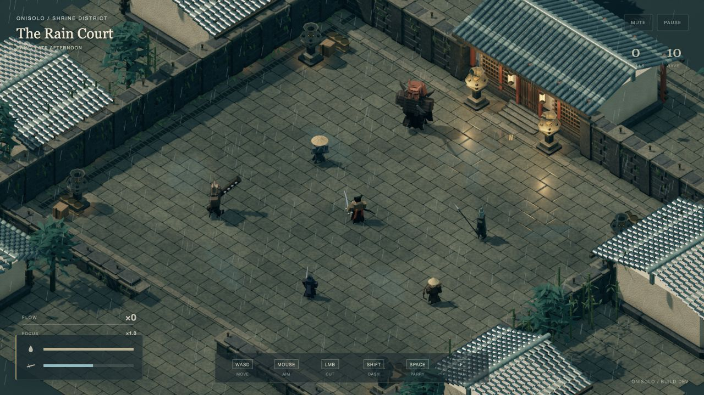

# Tile material correction

Build 98 projected an image of an entire masonry pattern across individual 3D
paving slabs. The image's mortar lines did not match the mesh joints, and
luminance-driven bump shading reinforced the second grid. This caused the
duplicated, blurred-looking edges visible in the production screenshot.

The build 99 correction removes that image from paving and wall stone materials.
The meshes now supply all joints. Procedural mineral variation and fine grain
add surface detail without additional seams. Grain fades below pixel size,
bump relief is shallower, and material colors retain the dark, wet stone palette.
Lighting, render resolution and geometry are unchanged.

Browser shader compilation and JavaScript syntax checks passed with no console
warnings or errors. The captures below use the same held Court study scene at
1280 × 720. These checks were completed locally before deployment.

A 20-second mixed-combat run with up to 24 enemies recorded 1,718 measured
frames: 10.77 ms mean, 16.80 ms P95, 17.60 ms P99, no frames over 25 ms and no
dropped simulation time. These are desktop measurements after the initial
1.5-second warm-up; they are not a controlled comparison with build 98.
See [the raw result](performance-tiles.json).

## Before

## After

